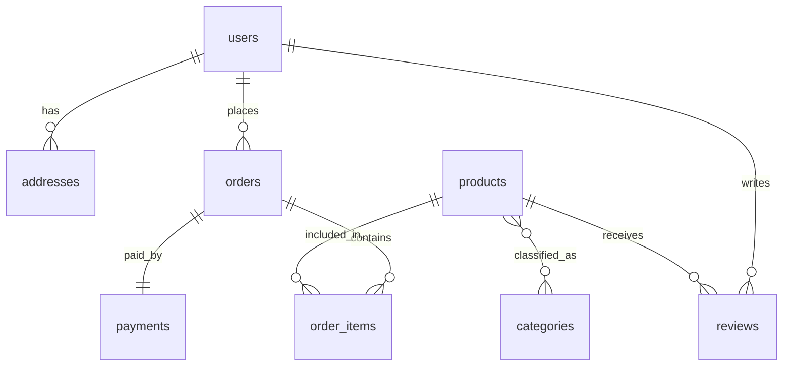

# 📦 E-commerce Database Management System  

## 📌 Project Overview  
This project is a **relational database management system (RDBMS)** designed for a small-scale **E-commerce store**. It models real-world entities such as **users, products, categories, orders, payments, reviews, and addresses**, with proper constraints and relationships.  

The database was built in **MySQL** as part of the *Foundation Database Module – Final Project (Week 8 Assignment)*.  

---

## 🎯 Objectives  
- Design a complete database schema for an e-commerce use case.  
- Implement relationships: one-to-one, one-to-many, and many-to-many.  
- Enforce constraints for data integrity (`PRIMARY KEY`, `FOREIGN KEY`, `NOT NULL`, `UNIQUE`, `CHECK`).  
- Provide sample data and queries for testing.  

---

## 🛠️ Technologies Used  
- **MySQL 8.0+**  
- **MySQL Workbench**  
- **VS Code**  

---

## 📂 Repository Structure
```text
📦 ecommerce-db-project
├── ecommerce_schema.sql   # Main database schema + sample data
├── erd.png                # ERD diagram
├── test_queries.sql       # Sample queries to validate schema
└── README.md              # Documentation
```

---

## 🗄️ Database Schema  

### Entities & Relationships  
- **Users** → customers  
- **Addresses** → linked to users (one-to-many)  
- **Categories** → group products  
- **Products** → items available for sale  
- **Product_Categories** → many-to-many bridge  
- **Orders** → purchases made by users  
- **Order_Items** → links orders and products  
- **Payments** → one-to-one with orders  
- **Reviews** → written by users for products  

---

## 🔗 ERD (Entity Relationship Diagram)  


# ⚡ Setup Instructions
Option 1: Run via MySQL Workbench

Open MySQL Workbench and connect to your server.

Go to File → Open SQL Script → Select ecommerce_schema.sql.

Execute the script (⚡ lightning button).

Refresh schemas → You should see ecommerce_db.

Option 2: Run via MySQL CLI
mysql -u root -p < ecommerce_schema.sql

## ✅ Testing the Schema
-- Switch to database
USE ecommerce_db;
```
-- Show tables
SHOW TABLES;
```
```
-- View users
SELECT * FROM users;
```

```
-- View orders with products
SELECT o.id AS order_id, u.username, p.name AS product, oi.quantity, oi.unit_price
FROM orders o
JOIN users u ON o.user_id = u.id
JOIN order_items oi ON o.id = oi.order_id
JOIN products p ON oi.product_id = p.id;
```

---

## 🧪 Test Queries
The file [`test_queries.sql`](./test_queries.sql) contains queries that validate:
- Table creation and relationships
- Inserted sample data
- Join queries (Orders with Users, Products with Categories, etc.)
- Constraint testing (`CHECK` for valid ratings and non-negative product prices)

Run them in MySQL Workbench with:
```sql
SOURCE test_queries.sql;
```


## 🔒 Constraints & Integrity

Primary Keys → unique identifiers

Foreign Keys → maintain relationships

Unique Keys → no duplicate emails/usernames

Check Constraints → validate numeric ranges (price ≥ 0, rating 1–5)

Cascade Rules → auto-delete related data


## 📊 Sample Data Included

Users: Alice, Bob

Products: USB-C Charger, Wireless Mouse, SQL Book

Orders: 1 order by Alice

Payments: linked to order

Reviews: Alice reviewing a product


## 🚀 Future Improvements

Add stored procedures for order placement.

Add triggers to auto-update stock.

Expand with more data.


## 👤 Author

Name: Tijani Ridwan Oluwaseun

Course: PLP Academy – Foundation Database Module (Week 8 Final Project)

Date: September 2025
